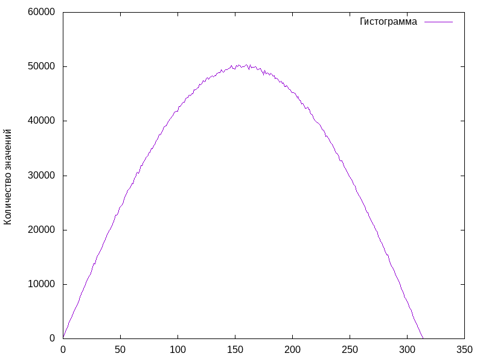

# Lab1

## Задания
- Величина подчиняющаяся закону f(x) = a * sin(x).
- Генератор с заданным распределением:
    * Непрерывное распределение
    * Дискретное
        * с возвращенияии
        * без возвращений

## Решение
Вывод программы:

    Distributed save to 'Distributed.res' file
    FROM FILELine count is 5
    1 0.5
    2 0.25
    3 0.125
    4 0.0625
    5 0.0625
    without Returns result
    1
    2
    5
    3
    4
    No more elements
    FROM FILELine count is 3
    1 0.25
    2 0.75
    3 1
    With returns histogram
    2489
    4961
    2550

Полученное непрерывное распределение:

